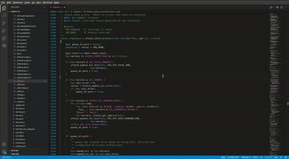
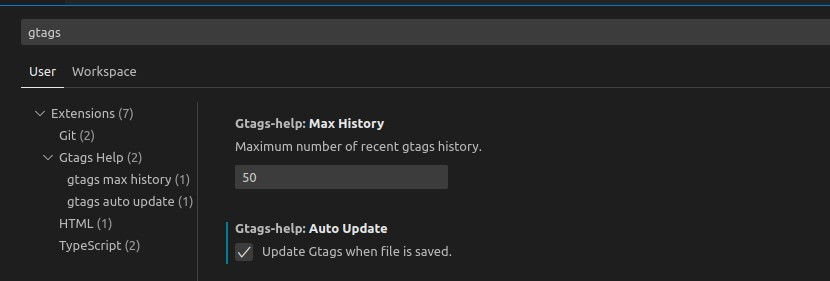

# Gtags Help

This extension helps to use GNU global for source code analysis.

## Requirement

You should have Gtags on workspace.
* [GNU Global](https://www.gnu.org/software/global/)
```
sudo apt-get install global
gtags
```

## Usage
1. You can search definition, reference Gtags with `ctrl + f10` on symbol.
2. You can adjust recent search history list(default: 50).
3. You can update Gtags automatically when save the file(defualt: false).





## Release Notes

### 0.0.1

Initial release.